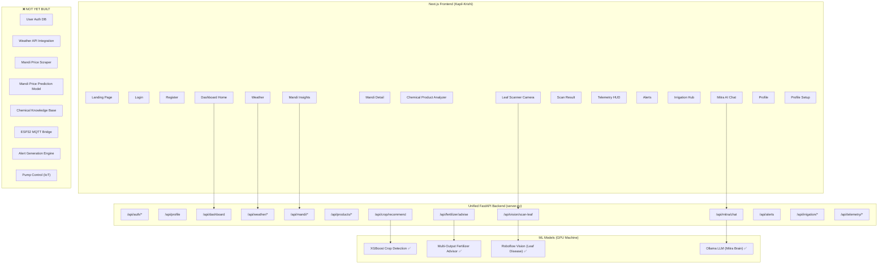

# SmartAgri — Full System Gap Analysis

## Architecture Overview

---

## ✅ WHAT'S READY (Models You Have)

| # | Model / System | Location | Status |
|---|---|---|---|
| 1 | **XGBoost Crop Detection** | `models/crop_detection/xgb_crop_model.pkl` | ✅ Trained, integrated into `POST /api/crop/recommend` |
| 2 | **Multi-Output Fertilizer Advisor** (9 targets: NPK deficits, soil health, water, pH, temp stress, urgency, planting readiness) | `models/fertilizer_optimization/master_ag_model.pkl` | ✅ Trained, integrated into `POST /api/fertilizer/advise` |
| 3 | **Roboflow Vision** (Leaf disease + soil type detection) | `src/vision/roboflow_client.py` | ✅ Working, integrated into `POST /api/vision/scan-leaf` |
| 4 | **Mitra Orchestrator** (Agentic pipeline: Vision→Crop→Fert→LLM) | `src/mitra/mitra_brain.py` | ✅ Working, integrated into `POST /api/mitra/chat` |

---

## ❌ WHAT'S STILL MISSING — Models & Systems You Need to Build

### 1. 🔐 User Authentication System
**Frontend pages that need it:** Login, Register, Profile, Profile Setup

| What's Needed | Details |
|---|---|
| **User Database** | PostgreSQL or SQLite table: `users(id, name, phone, email, password_hash, language, operation, soil_type, land_size, location_lat, location_lon, created_at)` |
| **Password Hashing** | Use `bcrypt` or `passlib` |
| **JWT Token System** | Issue JWT on login, validate on protected endpoints |
| **OTP Service** | Integrate Twilio / MSG91 / Firebase Auth for phone OTP |

> [!IMPORTANT]
> Currently all auth endpoints return placeholder data. No real user is stored.

---

### 2. 🌦️ Weather API Integration
**Frontend pages that need it:** Dashboard, Weather page

| What's Needed | Details |
|---|---|
| **Weather Data Provider** | OpenWeatherMap API (free tier: 1000 calls/day) or IMD (India Meteorological Dept) |
| **Endpoints to wire** | `GET /api/weather/current` and `GET /api/weather/forecast` |
| **Data needed** | Temperature, humidity, wind, rain probability, 48h hourly forecast, 7-day outlook |
| **Frost/alert logic** | Generate weather warnings when rain > 80% or temp < 5°C |

---

### 3. 📊 Mandi Price Prediction Model
**Frontend pages that need it:** Mandi Insights (15-day forecast chart), Mandi recommendation (HOLD/SELL/BUY)

| What's Needed | Details |
|---|---|
| **Training Data** | Historical APMC prices from [data.gov.in](https://data.gov.in) or [Agmarknet](https://agmarknet.gov.in) |
| **Model Type** | Time-series forecasting — LSTM, Prophet, or XGBoost with lag features |
| **Inputs** | Commodity name, historical prices (30-90 days), seasonal patterns, arrival volumes |
| **Outputs** | 15-day price forecast, BUY/SELL/HOLD recommendation |
| **Endpoint** | `GET /api/mandi/forecast?commodity=onion` |

---

### 4. 🏪 Mandi Price Scraper / Data Pipeline
**Frontend pages that need it:** Mandi Insights, Mandi Detail, Dashboard (commodity card)

| What's Needed | Details |
|---|---|
| **Data Source** | Agmarknet API, eNAM portal, or web scraper for daily APMC prices |
| **Pipeline** | Daily cron job → scrape → store in DB → serve via API |
| **Data needed** | Commodity name, price (min/max/modal), arrival qty, mandi name, date |
| **Nearby mandi logic** | Need GPS coordinates of all APMCs → distance calculation from user's farm |

---

### 5. 💊 Chemical Product Knowledge Base
**Frontend pages that need it:** Chemical Product Analyzer (`/mandi/product`)

| What's Needed | Details |
|---|---|
| **Database** | Pesticide/herbicide/fungicide catalog: `products(name, category, active_ingredient, toxicity_level, dosage, price, manufacturer)` |
| **Alternatives Engine** | Match products by active ingredient similarity, safety rating, price |
| **Data Source** | CIB&RC (Central Insecticides Board) registered products list |
| **Optional: AI Scan** | OCR on product label photo → identify product → find alternatives |

---

### 6. 📡 ESP32 / IoT Sensor Bridge
**Frontend pages that need it:** Telemetry HUD, Dashboard (moisture card), Irrigation Hub

| What's Needed | Details |
|---|---|
| **Hardware** | ESP32 with NPK sensor, soil moisture sensor, pH sensor, temperature/humidity (DHT22) |
| **Protocol** | MQTT broker (Mosquitto) — ESP32 publishes sensor data every 5 mins |
| **Backend bridge** | MQTT subscriber in Python → stores readings in InfluxDB or SQLite |
| **Endpoints to wire** | `GET /api/telemetry/live` and `POST /api/telemetry/sync` |

> [!NOTE]
> Currently all telemetry endpoints return hardcoded mock data. The models (Crop Detection, Fertilizer) are designed to accept this sensor data — they just need a real feed.

---

### 7. 🚨 Alert Generation Engine
**Frontend pages that need it:** Alerts page, Dashboard (crop alert card)

| What's Needed | Details |
|---|---|
| **Rule Engine** | Threshold-based alerts from sensor data (e.g., moisture < 30% → "Irrigation needed") |
| **ML-Based Alerts** | Use Fertilizer model's `Water_Requirement_Index` and `Temperature_Stress_Score` to generate proactive alerts |
| **Weather Alerts** | From weather API — heavy rain, frost, heatwave warnings |
| **Disease Alerts** | From Vision AI — if pest conditions are favorable based on humidity + temperature |
| **Storage** | Alert log table: `alerts(id, user_id, title, description, category, severity, created_at, read)` |

---

### 8. 💧 Pump / Irrigation IoT Control
**Frontend pages that need it:** Irrigation Hub, Dashboard ("Turn on Pump" button)

| What's Needed | Details |
|---|---|
| **Hardware** | Relay module connected to ESP32 → controls water pump |
| **Command Protocol** | MQTT publish from backend → ESP32 subscribes → toggles relay |
| **Power Schedule** | Integration with local power company schedule OR manual input |
| **Water Usage Tracking** | Flow meter sensor → daily water usage log |

---

## 📋 API Endpoint Summary — Frontend ↔ Backend Mapping

| Frontend Page | API Endpoint | Model/System Used | Status |
|---|---|---|---|
| **Login** | `POST /api/auth/login` | Auth DB + JWT | ❌ Placeholder |
| **Register** | `POST /api/auth/register` | Auth DB | ❌ Placeholder |
| **Dashboard Home** | `GET /api/dashboard` | Aggregated from all systems | ❌ Hardcoded |
| **Weather** | `GET /api/weather/current`, `/forecast` | OpenWeatherMap / IMD API | ❌ Needs API key |
| **Mandi Insights** | `GET /api/mandi/prices`, `/nearby`, `/forecast` | Price Scraper + Prediction Model | ❌ Needs scraper + model |
| **Mandi Detail** | `GET /api/mandi/detail/{name}` | Price DB | ❌ Needs data source |
| **Product Analyzer** | `GET /api/products/analyze` | Chemical Knowledge Base | ❌ Needs DB |
| **Telemetry HUD** | `GET /api/telemetry/live` | ESP32 MQTT Bridge | ❌ Needs hardware |
| **Leaf Scanner** | `POST /api/vision/scan-leaf` | **Roboflow Vision** | ✅ READY |
| **Scan Result** | (uses scan-leaf response) | **Vision + treatment DB** | ⚠️ Partial (vision works, treatment DB missing) |
| **Crop Recommend** | `POST /api/crop/recommend` | **XGBoost Crop Model** | ✅ READY |
| **Fertilizer Advise** | `POST /api/fertilizer/advise` | **Multi-Output XGBoost** | ✅ READY |
| **Mitra AI Chat** | `POST /api/mitra/chat` | **Full Agentic Pipeline** | ✅ READY (needs Ollama) |
| **Alerts** | `GET /api/alerts` | Alert Engine | ❌ Hardcoded |
| **Irrigation Hub** | `GET /api/irrigation/status` | ESP32 + Pump Control | ❌ Needs IoT |
| **Profile** | `GET/PUT /api/profile` | User DB | ❌ Placeholder |

---

## 🚀 Priority Build Order (Recommended)

1. **User Auth + DB** — Everything depends on knowing who the user is
2. **Weather API** — Easy win, just needs an API key (OpenWeatherMap)
3. **ESP32 MQTT Bridge** — Feeds real data to your working ML models
4. **Alert Generation Engine** — Uses data from weather + sensors + ML models
5. **Mandi Price Scraper** — Daily cron job to pull market data
6. **Mandi Price Prediction Model** — Train on scraped historical data
7. **Chemical Knowledge Base** — Database population task
8. **Pump IoT Control** — Hardware integration
